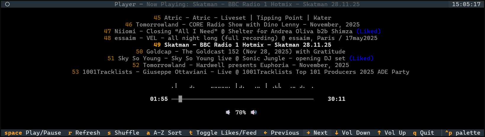

# SoundCloud Player



## The Problem

You follow a bunch of DJs and radio shows on SoundCloud who post incredible 2-hour mixes. You also follow people who post 90-second edits of cartoon sound effects. Your feed is chaos.

The official SoundCloud player can't filter by track length, requires keeping a browser tab open, and gets in the way when you just want to vibe to long-form mixes while you get some work done.

## My Solution - Maybe Also Yours?

A terminal-based music player that:
- Streams from your SoundCloud feed and likes
- Filters out short tracks (configurable, defaults to 30min+)
- Lives in your terminal where it belongs
- Has keyboard shortcuts so you never leave your flow state
- Works reliably using VLC on both Windows and MacOS

## Installation

```bash
uv pip install -e .
```

## Usage

```bash
scplay                           # Start with default 30min filter
scplay --min-track-length 60     # Only tracks 60+ minutes
scplay --reset-config            # Re-enter your OAuth token (basically never needed)
```

## Controls

- `Space` - Play/Pause
- `←/→` - Previous/Next track
- `↑/↓` - Volume
- `s` - Shuffle
- `a` - Sort A-Z
- `t` - Toggle between Feed/Likes
- `m` - Load more tracks
- `r` - Refresh current track (for when VLC gets moody)
- `q` - Quit

## Setup

You'll need a SoundCloud OAuth token. On first run, you'll be prompted to enter it. Get it from your browser's dev tools while logged into SoundCloud (check the Network tab for any API request and look for the `Authorization` header).

## Requirements

- Python 3.13+
- VLC

## License

MIT

## TODO - Maybe Tomorrow, Maybe Never

- Like/unlike tracks using `l`
- Allow seeking tracks
- Maybe combine this project with another messy one of mine that keeps an offline
  library of liked tracks
